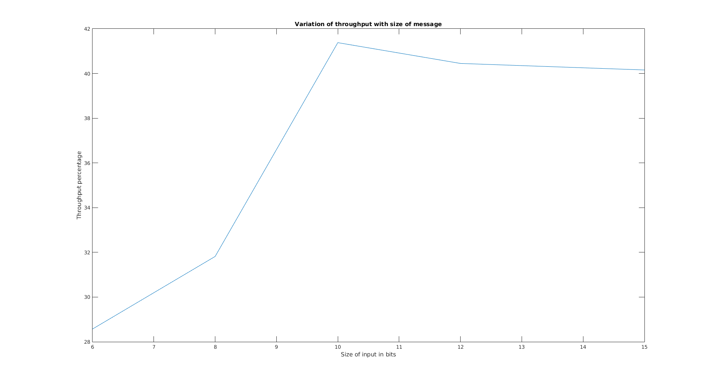

**Title :**   

Throughput analysis of ARQ selective-repeat protocol with time diversity in markov channels.

**Members :**

Polkampally Keerthana       (16CO131) - 16co131.keerthana@nitk.edu.in

Sumukha PK                  (16CO145) - 16co145.peekay@nitk.edu.in

Archana Priyadarshani Sahoo (16CO207) - 16co207.archana@nitk.edu.in

**Abstract :**

Most of the communication channels experience some pitfalls.This paper begins by looking at other types of protocols for transfer of data and quoting the flaws in them. Later it focuses on implementation of ARQ selective repeat protocol with timeout mechanism and its throughput efficiency.The go-back-n protocol works well if errors are rare,but if the line is poor it wastes a lot of bandwidth on retransmitted frames. An alternative strategy, the selective repeat protocol is to allow the receiver to accept and buffer the frames following a buffered or lost one .In Selective repeat protocol, both the sender and the receiver maintain a window of outstanding and acceptable sequence number respectively.In this paper the channel is modelled as Gilbert channel in each direction.Thus the patterns of packet and feedback are represented by transition matrices, one for each direction. It is assumed that the packet length is a constant and equal to one time unit. Generalization of the standard version of the Selective Repeat ARQ strategy is considered to analyze the throughput. The focus on ARQ selective repeat is because its power efficiency. A dependent structure for error process on two channels is assumed and modeled as markov chain which allows to compute throughput. It is shown that the use of an appropriate degree of time diversity makes it possible to approach the ideal protocol performance obtained with perfect feedback. Simulation results, that confirm the analysis and document the tightness of the bounds are also shown, and a number of implementation issues are discussed.

**Objectives :**

  1. Implementing ARQ selective-repeat protocol with time-diversity in Markov channels in MATLAB programming language.
  2. Finding the throughput of the ARQ selective repeat protocol.

**File structure :**

  1. main.m - The main file that is run is matlab, controls the whole process of simulation.
  2. packet.m - The class packet is implemented in this.
  3. check_empty.m - Checks whether a vector is empty
  4. check_complete.m - Checks whether a vector is full
  5. check_complete_block.m - checks whether block transmission is done.
  6. fill_slot.m - function to fill the buffer
  7. get_random.m - returns random value.
  8. transmit_buffer.m - clears the buffer 
  9. introduction.md - basic explanation of the protocol used and the project as a whole
  10. images - these are the image files that are linked to the introduction.md file
  11. Design.md - Explains the design procedure of the algorithm.  
  12. test_run.txt - has the output of the test run for graph in the repository 
  13. Graph - test run -- This has the graph obtained from testing the code with output in test_run.txt
  
**Graph:**
  

  
  
 